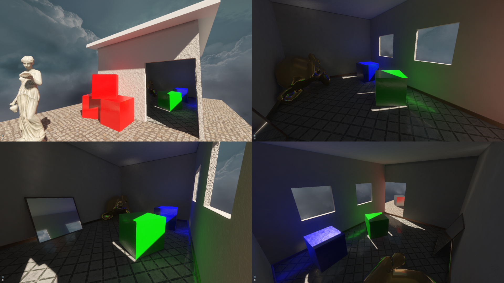

Precomputed Global Illumination for Games
==============

Game Development Practical SS18

Timothy Blut | 334609 | <timothy.blut@rwth-aachen.de>

## Project Details

* Main goal: Precompute diffuse and specular global illumination for use in realtime rendering.
* Shading model from Epic Games (Lambert for diffuse and GGX for specular)
	* With support for albedo, roughness and normal maps
* Forward PBR pipeline with HDR, filmic tone mapping, bloom, PCF shadows, dithering and FXAA
* glTF scene importer (allows Metallic/Roughness material setup)
* Indirect diffuse lighting is solved using irradiance maps (light maps)
    * Uses Intel's Embree for efficient ray/scene intersection tests
	* Irradiance for each light map texel is computed using an unidirectional path tracer
	* The path tracer uses importance sampling and supports a background cubemap, and albedo and roughness maps (but no normal maps)
	* To allow proper bilinear filtering without shadow bleeding, each texel that is not part of a triangle is set to the closest irradiance value
	* NOTE: The scene loader expects the light map UVs to be in channel 0 (channel 1 is for albedo/roughness/normal maps)
* Specular reflections are rendered using precomputed parallax corrected reflection probes
	* The probes are placed in a scene manually with the in-app UI
	* During the baking process the reflection maps are prefiltered using the proposed filtering method from Epic Games
	* A voxel grid that contains the three closest probes is used to determine which probes to interpolate
	* AABBs are used for parallax correction and specifying the influence region

## Setup

### Windows

Set the correct path to Embree 3.1 and add the `bin/` directory in the Embree installation directory to the PATH variable.
Open the Visual Studio solution and build.

### Linux

To build the project open a terminal and run:
    
    mkdir build
    cd build
    cmake ..
    make -j`nproc`

Before starting the application in any way, Embree must be added to the path with `source libs/embree-3.1.0.x86_64.linux/embree_vars.sh`

## Running

To start the application navigate to the bin directory and run, for example, `./BakedGI ./models/test2.glb ./textures/test2.lm ./textures/test2.pd`.

To bake a new light map run `./BakedGI ./models/test2.glb -bake somename.lm -irr width height samples_per_pixel`.

## Library licenses

* tiny_gltf.h : MIT license
* json.hpp : Copyright (c) 2013-2017 Niels Lohmann. MIT license.
* base64 : Copyright (C) 2004-2008 René Nyffenegger
* stb_image.h : v2.08 - public domain image loader - [Github link](https://github.com/nothings/stb/blob/master/stb_image.h)
* stb_image_write.h : v1.09 - public domain image writer - [Github link](https://github.com/nothings/stb/blob/master/stb_image_write.h)

## Textures

All textures are taken from [textures.com](https://www.textures.com/)
